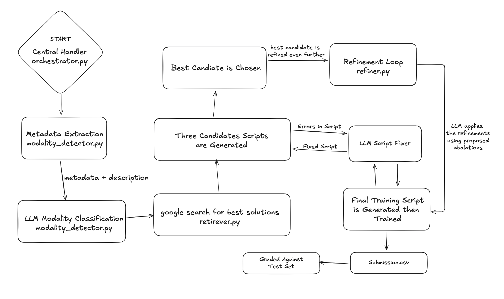

This is Melvin, an AI Machine Learning Engineer. Inspired from Devin which is an AI Software Engineer. Below are the things that Melvin can do autonomously: 
- Analyse the MLEbench lite datasets from Kaggle.
- Decides the type of ML task it needs to perform based on the analysis.
- Generates the optimal training script for the dataset.
- Runs the training script.
- Generates a submission.csv.
- Uses MLEbench's grader tool to get a score.


## Steps for Reproducability
1. Make a parent folder. Name it whatever you want. Eg: `mkdir MLEagent`

2. cd `MLEagent`
3. git clone `https://github.com/rajarshiroydev/melvin.git`
4. git clone `https://github.com/openai/mle-bench.git`

After doing the first 4 steps, the folder should look like this:
```
MLEagent/
├── melvin/
└── mle-bench/
```
5. `cd melvin`

6. `cp .env.example` `.env` then `rm .env.example`
7. Paste your gemini api key in `.env`
8. Start two terminals. One in melvin and the other in mle-bench.
9. In both the terminals, do `uv sync` then `source .venv/bin/activate` to activate the virtual environment.  

NOTE: Sometimes the IDE doesn't pick up the correct interpreter path so do `which python` while the virutal environment is active, copy that path. Do `cmd + shift + p`, (VScode) search for _python select interpreter_ then paste the interpreter path that you had copied. That should resolve any missing import errors.

10. You need a _kaggle.json_ file saved in your .kaggle folder in order to be able to download mlebench datasets. For this, go to your Kaggle profile settings, click on _Create Legagy API Key_, a _kaggle.json_ file will be downloaded. Place it in your .kaggle folder. **NOTE**: The location of the .kaggle folder varies based on the operating system so kindly do a google search to know about the exact location.

10. In the `mle-bench` directory, download any dataset from the MLEbench datasets list using `mlebench prepare -c <competition-id>`. competition-id is simply the competition name.

12. Once you have downloaded your desired dataset, go to the melvin terminal and use the command `python agents/orchestrator.py -c <competition-id>`. This will initiate the agent to perform its ML Engineering tasks.


### Deliverables
1. ✅ The agent runs end-to-end with a single command. While in the melvin directory use `python agents/orchestratory.py -c <competition-id> --seed n` to initiate the agent. The agent will find the dataset, generate training script, generate a submission.csv and get a score against it. _n_ will decide the number of seeds runs.

2. ✅ In order to generate the script, the agent doesn't rely on LLM hope shot. Here is how it generates a high quality training script:
    - A research agent searches the web for the top solutions of the given problem statement, finds the libraries and dependencies that the solution requires and then based on this info, generates three candidate training scripts.
    - These scripts are then individually run on a subset of the dataset to quickly assess which method performs the best.
    - Once the best candidate is selected, a script refinement layer tries to improve the best candidate script even further by doing abalations.
    - Based on whether an even better script was generated or not, the final script that performed the best on the subset data is chosen for training on the full dataset.
    - Finally a submission.csv is generated after the full training and inferencing on the test dataset.

3. In order to make the agent self-improve even more, I would implement the following:
    - Experience Replay Memory
        - The agent should persist winning strategies (model families, hyperparameters, preprocessing) per modality/task. Future runs would retrieve these “successful precedents” and bias the LLM generator toward proven architectures, reducing variance and improving reliability.

    - Automated Failure Pattern Learning
        - The agent can classify training failures (timeouts, heavy models, numpy incompatibility, broken augmentations) and automatically update its prompts to avoid recurring problematic patterns. This turns each crash into a learning signal.

    - Adaptive Candidate Space Expansion
        - Instead of only relying on retrieved candidates, the agent can automatically generate new model variants based on previously successful ones. It would perform auto-ablations, scale-depth exploration, and targeted hyperparameter variations to continuously enrich its search space.

### System Architecture


### Evaluation
My agent was not able to get any medal in the mentioned datasets. However it went really close in some of them. I will attach the scores here. Agents runs are still going on so if there is any medal or score improvements, I will update the scores.

#### Spooky Author Identification
- spooky-author-identification: Medal Threshold: 0.29381
- spooky-author-identification: Median Threshold: 0.418785
- spooky-author-identification: seed 42: 0.39147 > Median Threshold
- spooky-author-identification: seed 43: 0.35498 > Median Threshold
- spooky-author-identification: seed 44: 0.42204 > Median Threshold

#### Siim Isic Melanoma Classification
- siim-isic-melanoma-classification: Medal Threshold: 0.937
- siim-isic-melanoma-classification: Median Threshold: 0.9128
- siim-isic-melanoma-classification: seed 42: 0.90313 < Median Threshold

#### Tabular Playground Series May 2022
- tabular-playground-series-may-2022: Medal Threshold: 0.99818
- tabular-playground-series-may-2022: Median Threshold: 0.972675
- tabular-playground-series-may-2022: seed 42: 0.854012 < Median Threshold

